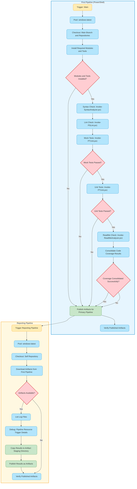

# FlowChart: Azure PowerShell Pipeline

```mermaid
flowchart TD
    %% Define Subgraph Styles
    style FirstPipeline fill:#E6F5FE,stroke:#0288D1,stroke-width:2px
    style ReportingPipeline fill:#FFF8E1,stroke:#F9A825,stroke-width:2px
    
    %% Define Process Node Styles
    classDef process fill:#B3E5FC,stroke:#0288D1,stroke-width:1px,rx:10px,ry:10px
    classDef decision fill:#FFCDD2,stroke:#D32F2F,stroke-width:2px,rx:5px,ry:5px
    classDef artifact fill:#C8E6C9,stroke:#388E3C,stroke-width:1px,rx:10px,ry:10px
    classDef trigger fill:#FFECB3,stroke:#FF9800,stroke-width:1px,rx:10px,ry:10px
    
    %% First Pipeline Subgraph
    subgraph FirstPipeline["First Pipeline (PowerShell)"]
        F1[Trigger: Main]:::trigger
        F2[Pool: windows-latest]:::process
        F3[Checkout: Main Branch and Repositories]:::process

        F4[Install Required Modules and Tools]:::process
        F4_decision{Modules and Tools Installed?}:::decision
        F5[Syntax Check: Invoke-SyntaxAnalyzer.ps1]:::process
        F6[Lint Check: Invoke-PSLint.ps1]:::process

        F7[Mock Tests: Invoke-PTUnit.ps1]:::process
        F7_decision{Mock Tests Passed?}:::decision

        F8[Unit Tests: Invoke-PTUnit.ps1]:::process
        F8_decision{Unit Tests Passed?}:::decision
        
        F9[ReadMe Check: Invoke-ReadMeAnalyzer.ps1]:::process

        F10[Consolidate Code Coverage Results]:::process
        F10_decision{Coverage Consolidated Successfully?}:::decision

        F11[Publish Artifacts for Primary Pipeline]:::artifact
        F12[Verify Published Artifacts]:::process

        F1 --> F2 --> F3 --> F4
        F4 --> F4_decision
        F4_decision -->|Yes| F5
        F4_decision -->|No| F11

        F5 --> F6 --> F7 --> F7_decision
        F7_decision -->|Yes| F8
        F7_decision -->|No| F11

        F8 --> F8_decision
        F8_decision -->|Yes| F9
        F8_decision -->|No| F11

        F9 --> F10 --> F10_decision
        F10_decision -->|Yes| F11 --> F12
        F10_decision -->|No| F11
    end

    %% Reporting Pipeline Subgraph
    subgraph ReportingPipeline["Reporting Pipeline"]
        R1[Trigger: On First Pipeline Completion]:::trigger
        R2[Pool: windows-latest]:::process
        R3[Checkout: Self Repository]:::process

        R4[Download Artifacts from First Pipeline]:::process
        R4_decision{Artifacts Available?}:::decision

        R5[List Log Files]:::process
        R6[Debug: Pipeline Resource Trigger Details]:::process

        R7[Copy Results to Artifact Staging Directory]:::artifact
        R8[Publish Results as Artifacts]:::artifact
        R9[Verify Published Artifacts]:::process

        R1 --> R2 --> R3 --> R4
        R4 --> R4_decision
        R4_decision -->|Yes| R5 --> R6 --> R7 --> R8 --> R9
        R4_decision -->|No| R9
    end

    %% Connection Between Pipelines
    F11 --> R1[Trigger Reporting Pipeline]


```
