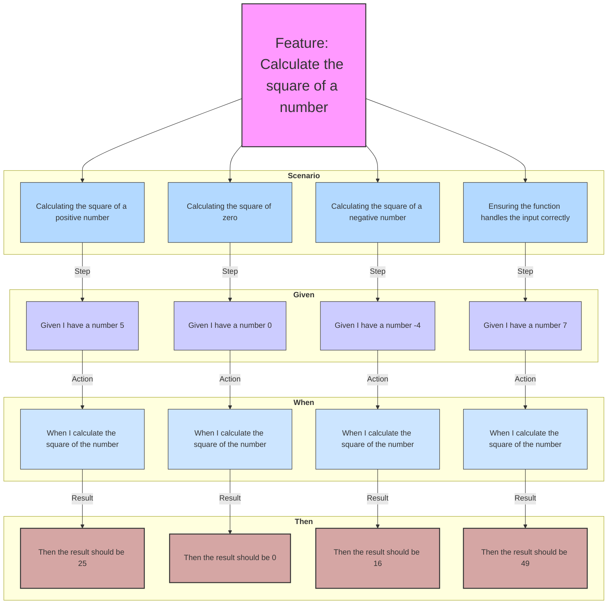

# **Business Driven Development:** *Calculate the Square of a Number*

## Gherkin Diagram

## Feature

**Title:** Calculate the square of a number.

### Scenario: Calculating the square of a positive number

- **Given** I have a number 5  
- **When** I calculate the square of the number  
- **Then** the result should be 25

### Scenario: Calculating the square of zero

- **Given** I have a number 0  
- **When** I calculate the square of the number  
- **Then** the result should be 0

### Scenario: Calculating the square of a negative number

- **Given** I have a number -4  
- **When** I calculate the square of the number  
- **Then** the result should be 16

### Scenario: Ensuring the function handles the input correctly

- **Given** I have a number 7  
- **When** I calculate the square of the number  
- **Then** the result should be 49
